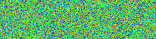
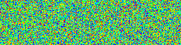
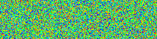
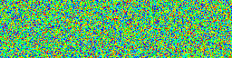

# Sorting algorithms

Sorting algorithms implemented in Go.\
Use as a learning resource.\
Clarity and simplicity, not so much performance, are the goals.

## Quicksort

The most interesting (and more practical) algorithm here is Tony Hoare's Quicksort.
It's relatively fast, only slightly slower than the standard library on the average case.
It's flexible, and gives you asymptotically optimal algorithms for median finding, top-K, etc
(which the standard library lacks).

This version avoids quadratic behavior by using median-of-ninthers when a bad pivot is detected:

The algorithm is fully deterministic,
and every step contributes to partially sorting the array.

## Heapsort

An implementation of Floyd's bottom-up Heapsort.

## Shellsort

An implementation of Shellsort with the Gonnet & Baeza-Yates gap sequence.

## Credits

Visualizations thanks to:
[`github.com/invzhi/sorting-visualization`](https://github.com/invzhi/sorting-visualization/)